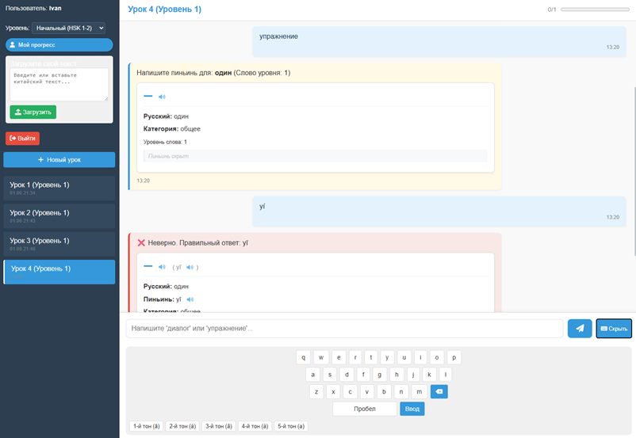

# Software-and-systems-development

Данный репозиторий содержит выполненные лабораторные работы по дисциплине "Разработка программного обеспечения и систем"

## Информация о студенте

- **ФИО:** Бойко Добрыня Владимирович  
- **Группа:** 4167

## Список лабораторных работ

| №   | Краткое описание                              | Ссылка на отчёт              |
|----|-----------------------------------------------|------------------------------|
| 1  | Основы работы с UML, построение диаграммы классов | [lab1](./task1/README.md)     |
| 2  | TBD                                  |     |
| 3  | TBD                               |     |

## Полезные ссылки

- [Сайт университета](https://kai.ru/)
- [Курс на образовательном портале](https://csharpcooking.github.io/)
- [Методические указания по GIT](https://git-scm.com/book/ru/v2/%D0%92%D0%B2%D0%B5%D0%B4%D0%B5%D0%BD%D0%B8%D0%B5-%D0%9E-%D1%81%D0%B8%D1%81%D1%82%D0%B5%D0%BC%D0%B5-%D0%BA%D0%BE%D0%BD%D1%82%D1%80%D0%BE%D0%BB%D1%8F-%D0%B2%D0%B5%D1%80%D1%81%D0%B8%D0%B9)

## О проекте

Лабораторные работы выполнены, опираясь на дипломную работу, которая называется "разработка интерактивного чат-бота для тренировки практических навыков китайского языка".

