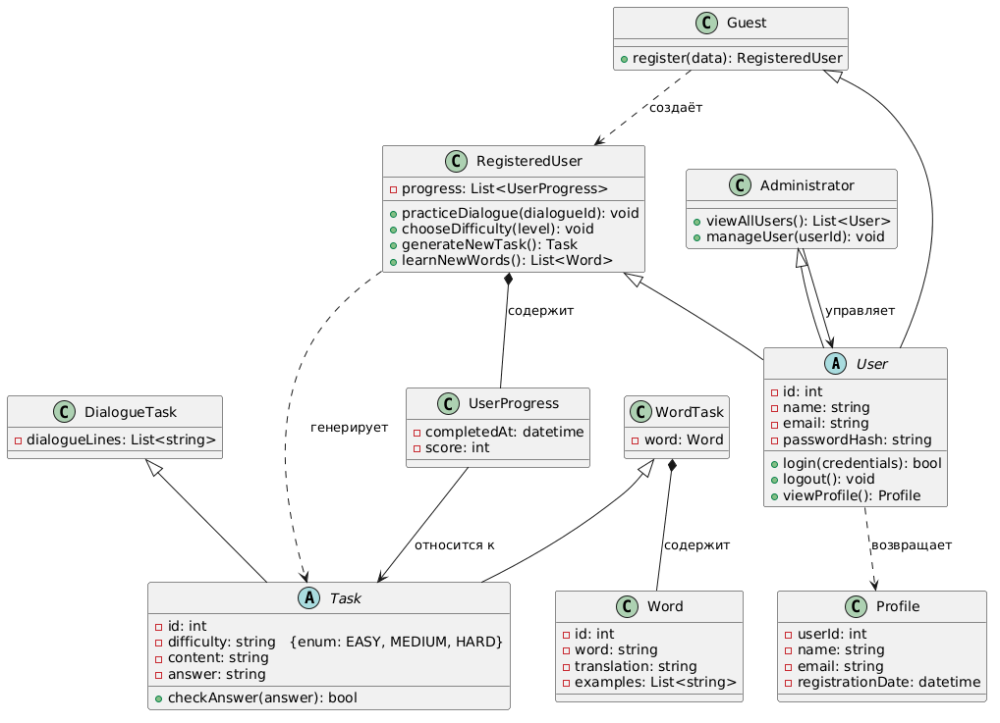

## Описание диаграммы классов системы "интерактивный чат-бот для тренировки практичесих навыков китайского языка"

Диаграмма классов моделирует систему изучения китайского языка. Абстрактный класс `User` (id, name, email, passwordHash) определяет общее поведение: `login`, `logout`, `viewProfile`. От него наследуются:
- `RegisteredUser` (хранит `progress`, методы: `practiceDialogue`, `chooseDifficulty`, `generateNewTask`, `learnNewWords`);
- `Administrator` (`viewAllUsers`, `manageUser`);
- `Guest` (`register`, создаёт `RegisteredUser`).

Абстрактный класс `Task` (id, difficulty, content, answer, `checkAnswer`) порождает `DialogueTask` (добавляет `dialogueLines`) и `WordTask` (содержит `Word`). Класс `Word` хранит слова, переводы и примеры.

`RegisteredUser` содержит коллекцию `UserProgress` (completedAt, score), каждый из которых относится к конкретному `Task`. Метод `viewProfile` возвращает объект `Profile` (userId, name, email, registrationDate).

**Отношения:** наследование (Users, Tasks), композиция (RegisteredUser — UserProgress, WordTask — Word), ассоциация (UserProgress → Task, Administrator → User), зависимости (Guest → RegisteredUser, RegisteredUser → Task, User → Profile).

Таким образом, система поддерживает регистрацию, генерацию заданий, отслеживание прогресса и администрирование.

## UML Class diagram: 