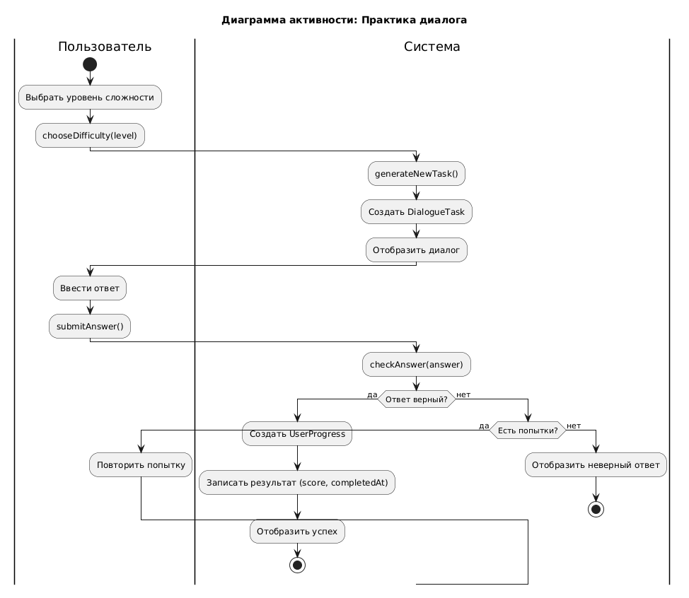
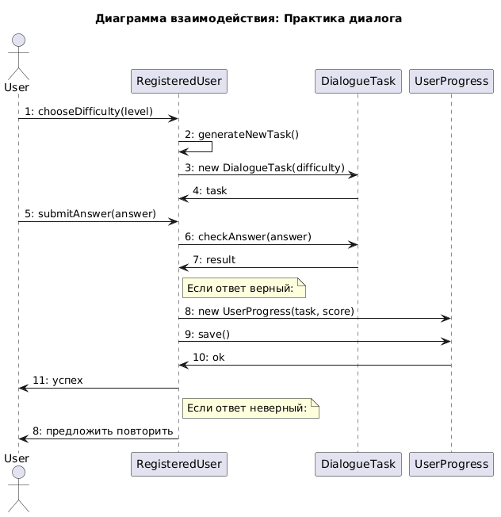
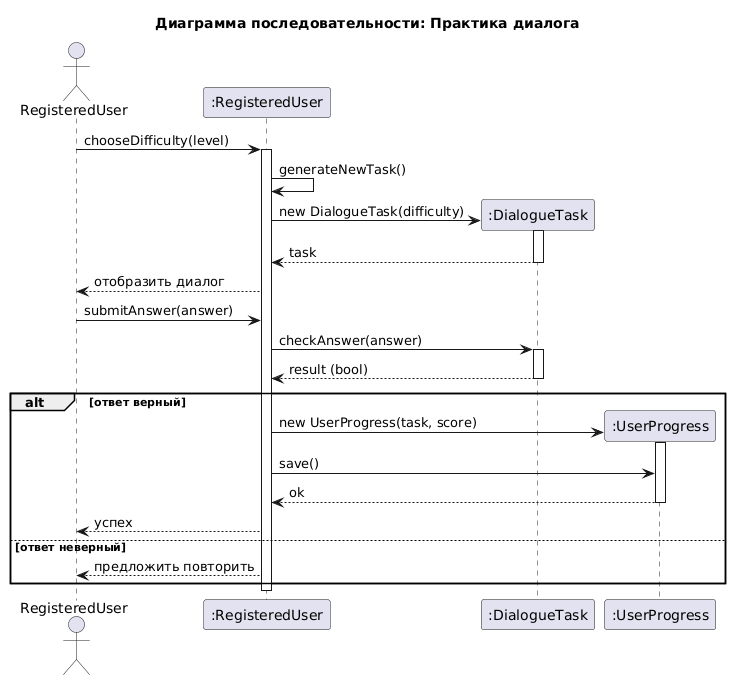
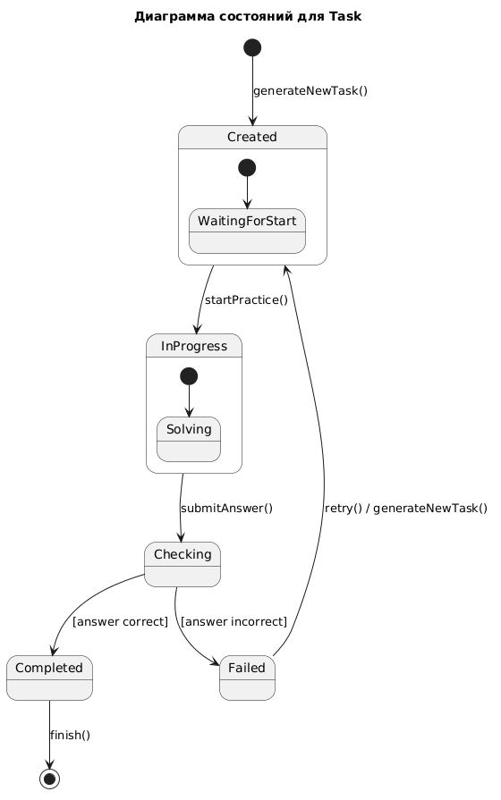

# README.md

## Диаграмма активности: Практика диалога

Диаграмма активности описывает процесс выполнения диалогового упражнения. Пользователь начинает с выбора уровня сложности (`chooseDifficulty`), после чего система генерирует новое задание (`generateNewTask`) и отображает диалог. Пользователь вводит ответ (`submitAnswer`), система проверяет его корректность (`checkAnswer`). Если ответ верный, создаётся запись о прогрессе (`UserProgress`) с сохранением результата и даты выполнения, после чего отображается сообщение об успехе. Если ответ неверный, проверяется наличие оставшихся попыток: при их наличии пользователь может повторить попытку, при отсутствии — отображается сообщение о неверном ответе и процесс завершается.

## Диаграмма взаимодействия: Практика диалога

Диаграмма взаимодействия показывает обмен сообщениями между актёром `User` и объектами `RegisteredUser`, `DialogueTask`, `UserProgress`. Пользователь инициирует выбор сложности (`chooseDifficulty`), после чего `RegisteredUser` генерирует новое задание, создаёт экземпляр `DialogueTask` и возвращает его. Затем пользователь отправляет ответ (`submitAnswer`), `RegisteredUser` делегирует проверку `DialogueTask`. В случае правильного ответа создаётся объект `UserProgress` с сохранением данных, и пользователю возвращается успех. При неверном ответе система предлагает повторить попытку.

## Диаграмма последовательности: Практика диалога

Диаграмма последовательности детализирует временной порядок взаимодействий между актёром `RegisteredUser` и объектами `RegisteredUser`, `DialogueTask`, `UserProgress`. После выбора сложности активируется объект `RegisteredUser`, который самостоятельно генерирует задание, создаёт `DialogueTask` и возвращает его пользователю. При отправке ответа `RegisteredUser` вызывает `checkAnswer` у `DialogueTask`, получая булевый результат. Альтернативный фрагмент (alt) разделяет сценарии: при верном ответе создаётся и сохраняется `UserProgress`, пользователь получает сообщение об успехе; при неверном ответе пользователю предлагается повторить попытку.

## Диаграмма состояний: Task

Диаграмма состояний описывает жизненный цикл задания (`Task`). Начальное состояние `Created` достигается после вызова `generateNewTask()`. Из `Created` переход в `InProgress` осуществляется методом `startPractice()`. Внутри `InProgress` задание находится в подсостоянии `Solving`. При вызове `submitAnswer()` происходит переход в состояние `Checking`. В зависимости от результата проверки задание переходит в `Completed` (если ответ верный) или `Failed` (если ответ неверный). Из `Failed` возможен повторный переход в `Created` через вызов `retry()` (с повторной генерацией задания), а из `Completed` задание завершается.

