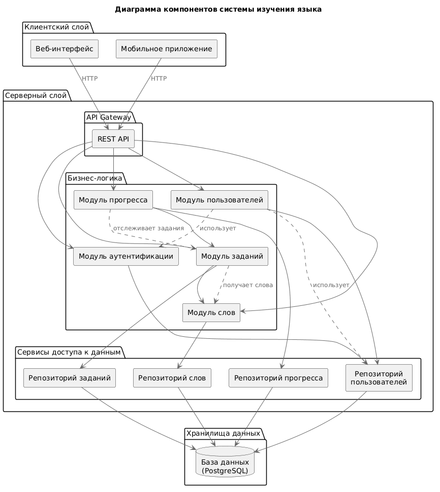
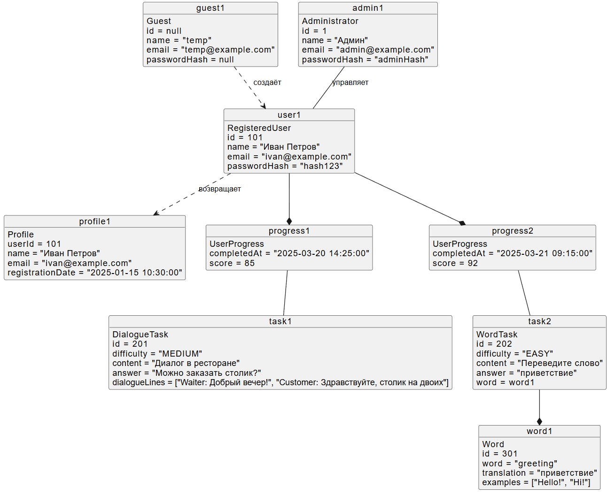
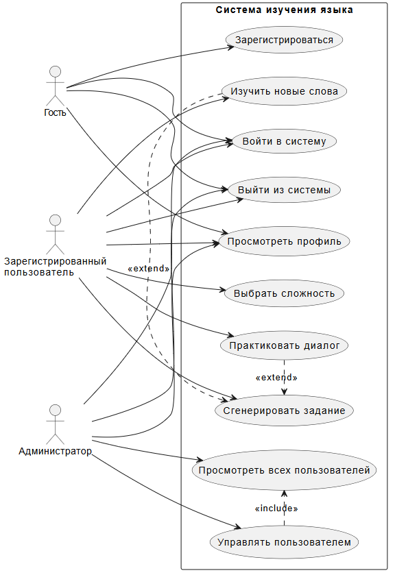
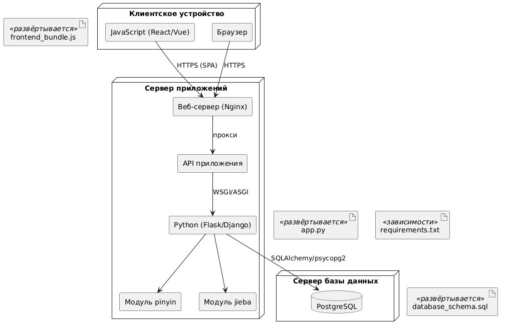

# README.md

## Диаграмма компонентов

Диаграмма компонентов отображает архитектурное разделение системы на три слоя: клиентский, серверный и хранилища данных. Клиентский слой представлен веб-интерфейсом, которые взаимодействуют с сервером через API Gateway (REST API). Серверный слой включает модули логики (аутентификация, пользователи, задания, слова, прогресс), каждый из которых использует соответствующий репозиторий для доступа к данным. Репозитории, в свою очередь, обращаются к единой базе данных PostgreSQL. Дополнительные связи показывают, что модуль заданий использует модуль слов для генерации контента, а модуль прогресса отслеживает задания. Такая структура обеспечивает разделение ответственности и масштабируемость.

## Диаграмма объектов

Диаграмма объектов иллюстрирует конкретные экземпляры классов системы в определённый момент времени. Здесь представлены объекты: гость (`Guest`), зарегистрированный пользователь (`RegisteredUser`), администратор (`Administrator`), профиль (`Profile`), записи прогресса (`UserProgress`), задания (`DialogueTask`, `WordTask`) и слово (`Word`). Для каждого объекта указаны значения атрибутов, например, `user1` имеет id=101, имя «Иван Петров» и email. Связи между объектами показывают, что пользователь владеет несколькими записями прогресса, каждая из которых относится к определённому заданию, а задание на слова содержит слово. Администратор управляет пользователем, а гость может создать зарегистрированного пользователя. Диаграмма демонстрирует реальные данные, которые система обрабатывает во время работы.

## Диаграмма вариантов использования

Диаграмма вариантов использования описывает функциональность системы с точки зрения взаимодействия актёров. Выделены три актёра: Гость, Зарегистрированный пользователь и Администратор. Гость может зарегистрироваться, войти в систему, выйти и просмотреть профиль. Зарегистрированный пользователь, помимо общих действий, имеет возможность практиковать диалог, выбирать сложность, генерировать задание и изучать новые слова. Администратор дополнительно может просматривать всех пользователей и управлять ими (включая просмотр списка). Вариант использования «Управлять пользователем» включает просмотр всех пользователей, а практика диалога и изучение слов расширяют генерацию задания. Такая структура позволяет чётко разграничить роли и доступный функционал.

## Диаграмма развёртывания

Диаграмма развёртывания показывает физическое распределение компонентов системы по узлам. Клиентское устройство содержит браузер и JavaScript-фронтенд (React/Vue), который общается с сервером приложений через HTTPS. Сервер приложений включает веб-сервер Nginx, Python-приложение (Flask/Django), а также специализированные модули для работы с китайским языком (pinyin, jieba) и API. Сервер базы данных размещает PostgreSQL. На диаграмме также указаны артефакты, развёртываемые на узлах: сборка фронтенда (`frontend_bundle.js`), код приложения (`app.py`) с зависимостями (`requirements.txt`) и схема базы данных (`database_schema.sql`). Такая конфигурация обеспечивает безопасное взаимодействие, масштабируемость и поддержку специфической функциональности.

