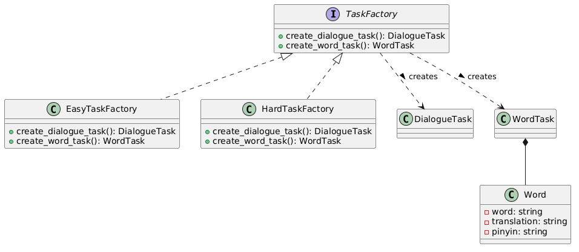
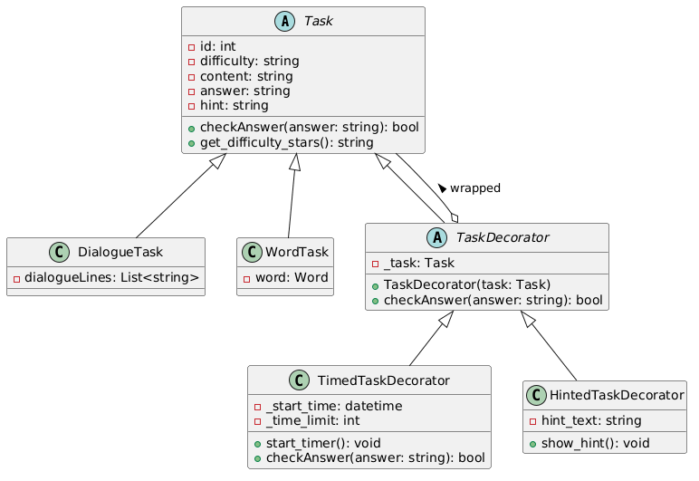
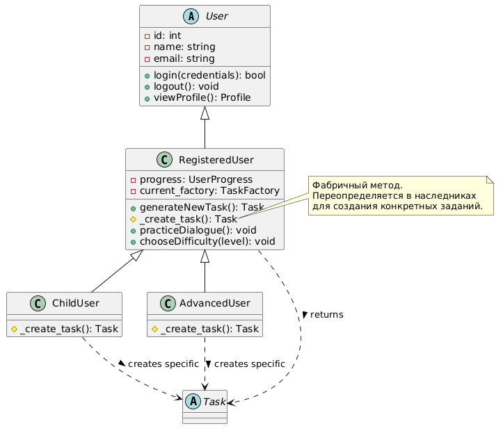
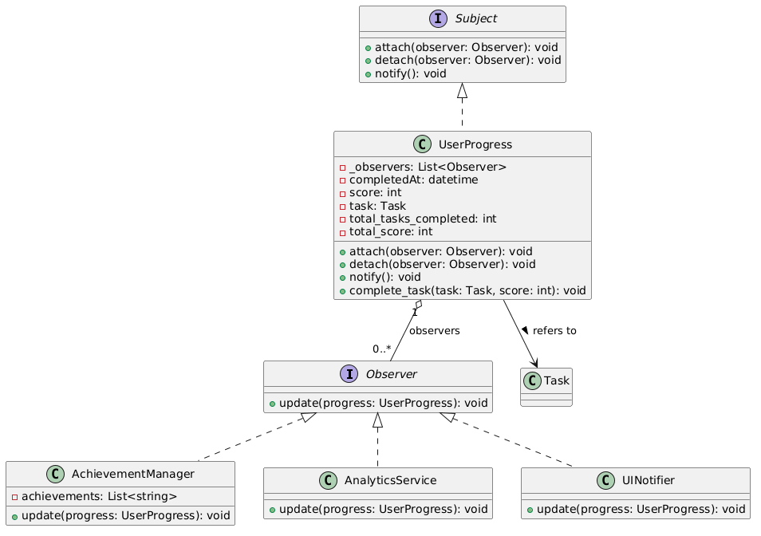

# Система интерактивного чат-бота для тренировки китайского языка

В основе архитектуры системы лежат четыре ключевых паттерна проектирования: **Абстрактная фабрика**, **Декоратор**, **Фабричный метод** и **Наблюдатель**. Они обеспечивают гибкость создания заданий, расширение функциональности без изменения существующего кода, адаптацию под разные категории пользователей и реакцию на события прогресса. Ниже представлены диаграммы, иллюстрирующие реализацию этих паттернов.

---

## Диаграмма Abstract Factory

Абстрактная фабрика (`TaskFactory`) определяет интерфейс для создания двух типов продуктов: `DialogueTask` (задание-диалог) и `WordTask` (задание-слово). Конкретные фабрики `EasyTaskFactory` и `HardTaskFactory` реализуют создание заданий соответствующего уровня сложности. Это позволяет легко добавлять новые фабрики (например, для среднего уровня) без изменения клиентского кода. Каждое задание на слово композиционно включает объект `Word` с атрибутами `word`, `translation`, `pinyin`.

---

## Диаграмма Decorator

Декоратор позволяет динамически добавлять заданиям новое поведение. Базовый абстрактный класс `Task` содержит общие атрибуты (`id`, `difficulty`, `content`, `answer`, `hint`) и методы (`checkAnswer`, `get_difficulty_stars`). Конкретные задания (`DialogueTask`, `WordTask`) наследуются от `Task`. Абстрактный декоратор `TaskDecorator` оборачивает объект `Task` и делегирует ему вызовы. Конкретные декораторы `TimedTaskDecorator` (добавляет таймер и ограничение по времени) и `HintedTaskDecorator` (добавляет подсказки) расширяют поведение заданий, не изменяя их исходный код.

---

## Диаграмма Factory Method

Фабричный метод используется для создания заданий, адаптированных под разные категории пользователей. Абстрактный класс `User` определяет общие свойства и методы. `RegisteredUser` (зарегистрированный пользователь) вводит фабричный метод `_create_task()`, который возвращает объект `Task`. В зависимости от типа пользователя (`ChildUser` или `AdvancedUser`) этот метод переопределяется и создаёт задания с разной сложностью или структурой. Клиентский метод `generateNewTask()` вызывает фабричный метод, получая нужное задание. Такой подход упрощает добавление новых типов пользователей без изменения существующей логики.

---

## Диаграмма Observer

Паттерн Наблюдатель реализует механизм оповещения о прогрессе пользователя. `UserProgress` выступает в роли субъекта (`Subject`): он хранит список наблюдателей, а также информацию о завершённом задании, набранных очках и общем прогрессе. При вызове `complete_task()` субъект уведомляет всех подписчиков через `notify()`. Конкретные наблюдатели:
- `AchievementManager` – проверяет условия и выдаёт достижения;
- `AnalyticsService` – собирает статистику для анализа;
- `UINotifier` – отображает уведомления в интерфейсе.

Это позволяет легко добавлять новые реакции на события (например, логирование или синхронизацию с облаком) без изменения логики прогресса.

---

## Реализация и развёртывание

Система реализована на Python. В текущей версии используется консольный интерфейс, все компоненты работают в одном процессе. Хранение данных может быть организовано через SQLite (для локального использования) или PostgreSQL (для масштабирования). Перечисленные паттерны обеспечивают высокую гибкость: легко добавить новые типы заданий (через фабрику), временные ограничения или подсказки (через декоратор), адаптировать поведение для разных пользователей (через фабричный метод) и расширить систему уведомлений (через наблюдателя). Архитектура готова к переходу на веб-платформу с минимальными изменениями.